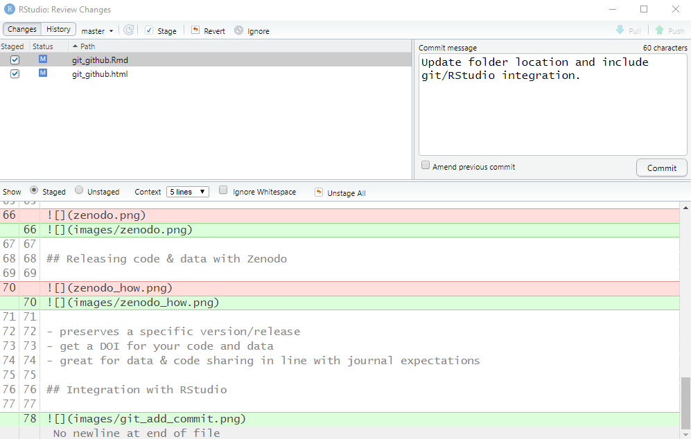

```{r setup, include=FALSE}
knitr::opts_chunk$set(echo = FALSE)
```

## What are Git & GitHub?

- *Git* is an open source version control software - it allows you to keep track of all changes made by storing each change as a version. This is on your local computer

- *GitHub* is a website that provides hosting for Git repositories. This is where the collaboration magic happens

## Why use Git & GitHub?

A workflow that includes Git & GitHub:

- has collaboration and communication integrated into the workflow
- documents all changes and identifies who made that change and why
- GitHub has a bunch of features like issues and projects

## Why use Git & GitHub

Document comparison

## Basic Workflow


## Branches


## Collaborative Workflow


## Issues


## Issues


## Issues

- Can be used as a to-do list
- Can be assigned to specific collaborators
- Can be opened by anyone to request feature updates and bug fixes

## Projects


## Releasing code & data with Zenodo


## Releasing code & data with Zenodo


- preserves a specific version/release
- get a DOI for your code and data
- great for data & code sharing in line with journal expectations

## Integration with RStudio


## Integration with RStudio



## Additional Resources

[GitHub Learning Labs](https://lab.github.com/)

[Happy Git and GitHub for the useR](https://happygitwithr.com/)

[Oh Shit, Git!?!](https://ohshitgit.com/)